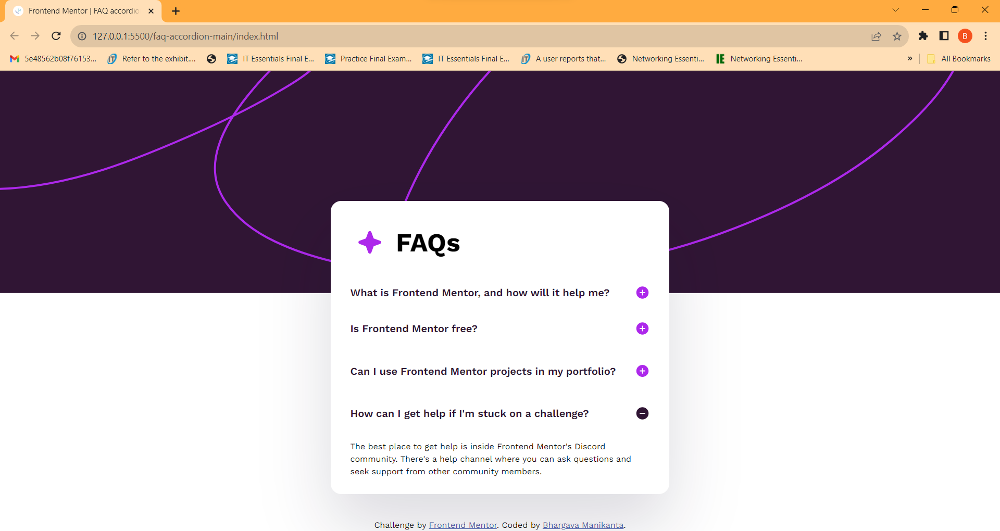

# Frontend Mentor - FAQ accordion

## Welcome! 👋

Thanks for checking out this front-end coding challenge.

[Frontend Mentor](https://www.frontendmentor.io) challenges help you improve your coding skills by building realistic projects.

**To do this challenge, you need a basic understanding of HTML, CSS and JavaScript.**

# Frontend Mentor - FAQ accordion solution

This is a solution to the [FAQ accordion challenge on Frontend Mentor](https://www.frontendmentor.io/challenges/faq-accordion-wyfFdeBwBz). Frontend Mentor challenges help you improve your coding skills by building realistic projects.

## Table of contents

- [Overview](#overview)
  - [The challenge](#the-challenge)
  - [Screenshot](#screenshot)
  - [Links](#links)
- [My process](#my-process)
  - [Built with](#built-with)
  - [What I learned](#what-i-learned)
  - [Continued development](#continued-development)
  - [Useful resources](#useful-resources)
- [Author](#author)
- [Acknowledgments](#acknowledgments)

**Note: Delete this note and update the table of contents based on what sections you keep.**

## Overview

### The challenge

Users should be able to:

- Hide/Show the answer to a question when the question is clicked
- Navigate the questions and hide/show answers using keyboard navigation alone
- View the optimal layout for the interface depending on their device's screen size
- See hover and focus states for all interactive elements on the page

### Screenshot

### Links

- Solution URL: [Add solution URL here](https://github.com/Bhargava999/faq-accordian-main)
- Live Site URL: [Add live site URL here](https://bhargava999.github.io/faq-accordian-main/)

## My process

### Built with

This project was built using the following technologies:

- **HTML5:** Utilized semantic HTML markup to structure the content of the FAQ accordion.

- **CSS3:** Employed CSS for styling the components, including the use of flexbox, transitions, and media queries for responsive design.

- **JavaScript:** Implemented interactive features such as the accordion functionality using vanilla JavaScript. Managed DOM manipulation and event handling to create a dynamic user experience.

- **Frontend Mentor:** Leveraged the design provided by Frontend Mentor as a starting point, contributing to the real-world design challenges aspect of the project.

These technologies were chosen to create a responsive, visually appealing, and interactive FAQ accordion that meets the project requirements.

### What I learned

In the process of completing this FAQ accordion project, I gained valuable insights and skills:

- **Accordion Functionality:** Implemented a responsive accordion feature using JavaScript to toggle the display of answers when questions are clicked. This enhanced my understanding of DOM manipulation and event handling.

- **CSS Styling Techniques:** Explored and applied CSS styling techniques such as flexbox, transitions, and hover effects to create an aesthetically pleasing and user-friendly interface. The use of CSS custom properties improved maintainability.

- **Responsive Design:** Ensured a seamless user experience across different devices by incorporating a responsive design approach. Utilized media queries to adapt the layout for smaller screens.

- **Collaboration with Frontend Mentor:** Engaged with the Frontend Mentor community by working on a challenge, which provided exposure to real-world design problems and solutions. It also allowed me to receive feedback and learn from others.

- **Documentation:** Practiced documenting my code and project. This README file serves as a guide for others to understand the project, its features, and my thought process.

These learnings have contributed to my growth as a frontend developer, and I plan to apply these skills in future projects to create more interactive and visually appealing web applications.

### Continued development

While completing this FAQ accordion project, I identified areas for improvement and future development:

- **Accessibility Features:** Enhance accessibility by ensuring the accordion is fully navigable using keyboard controls. Implement ARIA attributes and focus management to improve the experience for users with disabilities.

- **Animations:** Introduce subtle animations to create a smoother and more visually appealing transition when expanding or collapsing accordion items. This could include fade-ins, slide effects, or other animations to improve the overall user experience.

- **Testing:** Conduct thorough testing across various browsers and devices to ensure consistent functionality and styling. Address any cross-browser compatibility issues and fine-tune the design for different screen sizes.

- **Code Refactoring:** Review and refactor the codebase for improved readability and maintainability. Consider breaking down the JavaScript functions into smaller, reusable modules and optimizing CSS styles for better organization.

- **Mobile Optimization:** Further optimize the design for mobile devices, ensuring a seamless and intuitive experience on smaller screens. Test and refine the layout to accommodate different screen sizes and resolutions effectively.

- **Community Feedback:** Seek feedback from the Frontend Mentor community or other developers to gather insights and suggestions for improvement. Incorporate constructive feedback to refine both the functionality and design of the FAQ accordion.

- **Additional Features:** Explore the possibility of adding extra features to enhance user engagement, such as search functionality, sorting options, or the ability to bookmark favorite questions.

These focus areas represent my plans for the project's continued development, and I aim to iterate on the current implementation to create a more polished and feature-rich FAQ accordion

### Useful resources

During the QR code component project, I found the following resources helpful:

- [Frontend Mentor](https://www.frontendmentor.io?ref=challenge): A great platform for honing front-end development skills and finding real-world projects.
- [Google Fonts](https://fonts.google.com/): Used to access a wide variety of fonts and improve the typography of the project.

## Author

- [Bhargava Manikanta Mamidisetti](https://www.linkedin.com/in/bhargava-manikanta-mamidisetti-1022a3222/)
- Frontend Mentor - [@Bhargava999](https://www.frontendmentor.io/profile/Bhargava999)

## Acknowledgments

I'd like to extend my gratitude to Frontend Mentor for providing a platform with real-world challenges that allowed me to apply and improve my front-end development skills.
